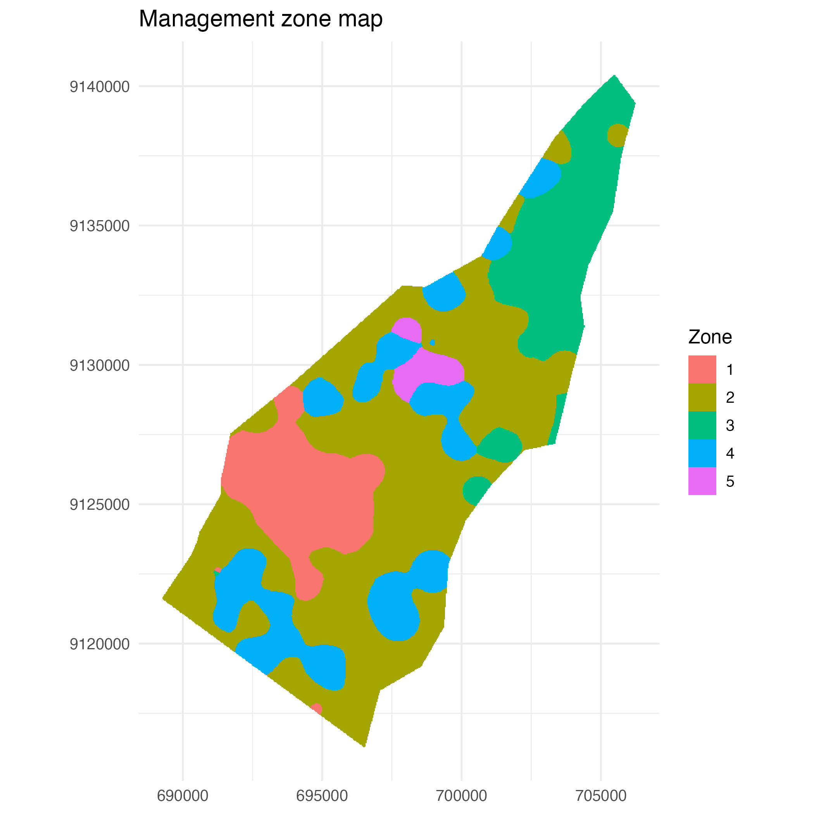
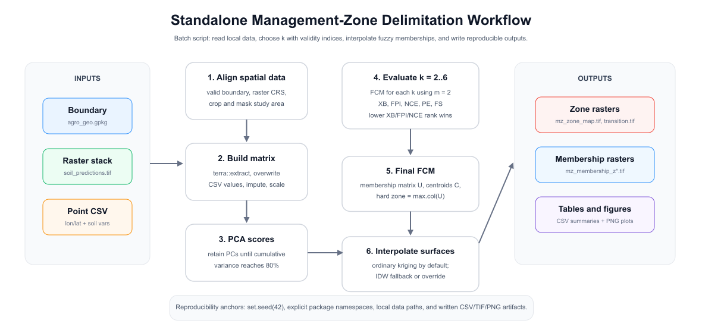
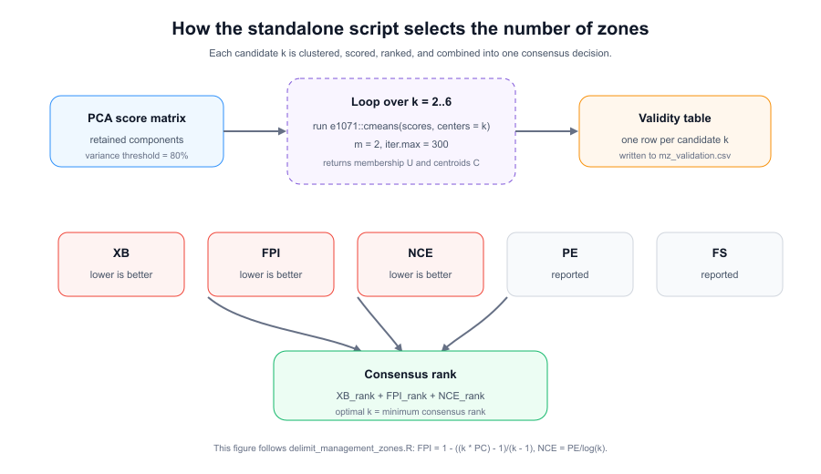
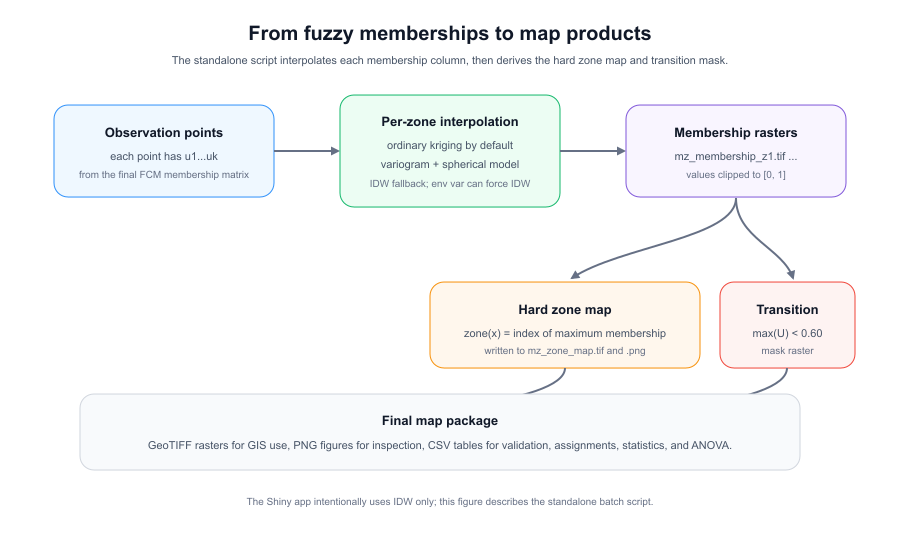
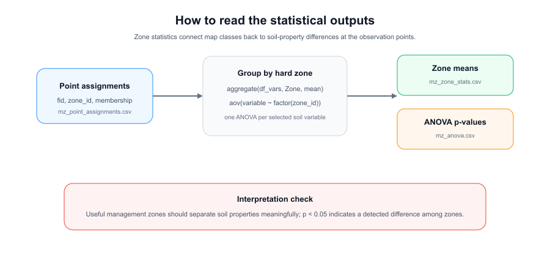

# Management Zone Delimitation — Fuzzy C-Means Clustering

An R toolkit that delineates agricultural management zones from multi-layer
soil-property rasters and point observations using Fuzzy C-Means (FCM)
clustering, PCA dimensionality reduction, and spatial interpolation. It ships
in two interchangeable forms that share the same numeric pipeline:

- **Batch script** — [`delineation_management_zones.R`](delineation_management_zones.R), run from the command line for reproducible, scripted output.
- **Interactive app** — [`shiny_mz_app.R`](shiny_mz_app.R), a point-and-click Shiny app that walks you through the same six steps in the browser. See [Interactive Shiny app](#interactive-shiny-app) below.



> For a detailed walkthrough of the methodology and results, see the Medium article:
> [Delineating Agricultural Management Zones with Fuzzy C-Means](https://medium.com/@cmcarbajal/delineating-agricultural-management-zones-with-fuzzy-c-means-7bdc9ca537c7)

---

## Overview



The script reads three local data sources, builds a normalized soil-property
matrix, reduces dimensionality with PCA, evaluates k = 2–6 candidate zone
counts with five cluster-validity indices, fits the final FCM model, and
interpolates per-zone membership surfaces across the study area. All results
are written as reproducible GeoTIFF, CSV, and PNG artifacts.

---

## Repository layout

```
Delineation_MZ/
├── delineation_management_zones.R   # Batch / command-line script
├── shiny_mz_app.R                   # Interactive Shiny app
├── R/                               # Reusable R helpers
│   └── render_mz_report.R           # Wrapper that calls the Quarto CLI
├── report/
│   ├── mz_report.qmd                # Quarto source for the results report
│   └── mz_report.html               # Pre-rendered HTML report (regenerate to refresh)
├── www/                             # App static assets (logo, User Guide figures)
│   ├── mz_logo.svg
│   └── assets/figures/              # Diagrams + sample outputs shown in the guide
├── data/
│   ├── agro_geo.gpkg                # Study-area boundary polygon
│   ├── soil_predictions.tif         # Multi-layer soil-property raster
│   └── soilgrids_data.csv           # Point observations with soil variables
├── figures/                         # Workflow diagrams (this README)
└── outputs/                         # All script outputs (generated)
```

---

## Requirements

Install dependencies from an R console before running the script:

```r
install.packages(c("e1071", "gstat", "sf", "terra", "sp",
                   "ggplot2", "patchwork"))
# optional but recommended for labelled plots:
install.packages("ggrepel")
```

| Package | Role |
|---------|------|
| `terra` / `sf` | Raster and vector I/O, reprojection, masking |
| `e1071` | Fuzzy C-Means via `cmeans()` |
| `gstat` | Ordinary kriging and IDW interpolation |
| `ggplot2` / `patchwork` | Validation and zone map figures |
| `effectsize` | η² effect size for the per-variable ANOVA table (optional, report only) |

The **report** layer also needs the [Quarto CLI](https://quarto.org/docs/get-started/)
(`>= 1.3`) on your `PATH`. The R `quarto` package is **not** required; the wrapper
shells out to the CLI directly.

The **Shiny app** needs a few more packages on top of the above — see
[Interactive Shiny app](#interactive-shiny-app) for the full install line.

---

## Running the script

```bash
Rscript delineation_management_zones.R
```

The interpolation method defaults to **ordinary kriging**. Override with an
environment variable:

```bash
MZ_INTERPOLATION_METHOD=idw Rscript delineation_management_zones.R
```

---

## Interactive Shiny app

`shiny_mz_app.R` is a self-contained Shiny app that runs the **same** PCA → FCM →
validation → kriging pipeline as the batch script, but interactively: you upload
your data, tune settings, and step through six tabs in the browser. It opens on a
built-in **User Guide** tab, so you can also learn the workflow from inside the app.

### Install

The app needs the analysis packages plus the Shiny UI stack:

```r
install.packages(c(
  # analysis (same as the batch script)
  "e1071", "vegan", "gstat", "sf", "terra", "sp",
  "ggplot2", "ggrepel", "patchwork", "tidyr",
  # interactive UI
  "shiny", "shinythemes", "shinyjs", "shinycssloaders", "plotly", "DT"
), repos = "https://cran.r-project.org")
```

### Launch

Run it from the **repository root** (so the app can serve the `www/` assets —
the logo and the User Guide figures):

```bash
R -e 'shiny::runApp("shiny_mz_app.R", launch.browser = TRUE)'
```

Or open `shiny_mz_app.R` in RStudio and click **Run App**. The app prints a local
URL (e.g. `http://127.0.0.1:xxxx`) and opens it in your default browser.

> The upload limit is set to 1 GB, which covers most field-scale GeoTIFFs. Adjust
> `options(shiny.maxRequestSize = ...)` near the top of the script if you need more.

### Data you upload

The same three inputs as the batch script, supplied through the **Data Input** tab:

| Input | Formats | Notes |
|-------|---------|-------|
| Study-area boundary | `.gpkg`, `.shp`, `.geojson` | Polygon; the raster is cropped & masked to it. |
| Soil-property raster | `.tif`, `.asc`, `.bil` | One band per property; layer names should match the CSV columns where possible. |
| Observation points | `.csv` | Longitude/latitude (or projected X/Y) + numeric soil columns. Include an `fid` column to join assignments back to your data. |

You then pick **≥ 3 numeric variables** to cluster on, set the coordinate column
names, and choose how point coordinates are interpreted (**auto-detect**,
`EPSG:4326`, or *same as raster CRS*).

### The six steps

| # | Tab | What you do |
|---|-----|-------------|
| 1 | **Data Input** | Upload the three files, select variables, set CRS / fuzziness `m` / PCA variance threshold, then **Load Data & Continue** (runs PCA). |
| 2 | **Validation** | Pick the k range and the optimal-k method (FPI / NCE / XB / PE / FS, or the XB+FPI+NCE *Auto* consensus), then **Run Validation**. All indices are **lower-is-better**; the chosen k is highlighted. |
| 3 | **Clustering** | Accept the optimal k or override it, then **Run FCM Clustering** to get hard zone assignments per point. |
| 4 | **Zone Maps** | Membership surfaces are kriged and the hard zone map is built automatically (large rasters are downsampled so the UI stays responsive). Use **Regenerate** to recompute. |
| 5 | **Statistics** | Per-zone mean soil properties, one-way ANOVA per variable, and a comparison plot. |
| 6 | **Export** | Download the results (see below). |

### Try it with the bundled demo

The `data/` folder is a ready-made SoilGrids example. Upload `agro_geo.gpkg`,
`soil_predictions.tif`, and `soilgrids_data.csv`, keep the defaults, and you will
reproduce the **k = 5** solution shown in this README.

### Exports

The **Export** tab streams files straight to your browser's download folder
(nothing is written to the server), matching the batch script's output names:

| Button | File |
|--------|------|
| Validation CSV | `mz_validation.csv` |
| Zone statistics CSV | `mz_zone_stats.csv` |
| Point assignments CSV | `mz_point_assignments.csv` |
| ANOVA results CSV | `mz_anova.csv` |
| Zones GeoTIFF | `mz_zone_map.tif` (INT1U, CRS preserved) |
| Zone map PNG | `mz_zone_map.png` (300 DPI, with legend) |

### Troubleshooting

- **Zone Maps tab shows "Waiting for…"** — finish the step it names (you must load
  data, run validation, then clustering before maps can build).
- **Step 4 feels slow** — kriging is the heavy step (a few seconds to ~30 s on a
  field-scale raster). Larger rasters are downsampled internally; it will not hang.
- **A diagnostic log** is written to `mz_debug.log` next to the script. Set
  `MZ_DEBUG <- FALSE` near the top to silence it.

---

## Generating a report

[`report/mz_report.qmd`](report/mz_report.qmd) is a self-contained **Quarto** document
that turns the contents of `outputs/` into a publication-style report: executive
summary, input metadata, PCA variance, cluster-validity table and figure, the final
zone map, per-zone statistics with η² effect sizes, a membership-entropy uncertainty
map, and a reproducibility section with the exact pipeline parameters and
`sessionInfo()`.

A pre-rendered copy lives at `report/mz_report.html` so you can preview the result
without re-running anything. To regenerate it from R:

```r
source("R/render_mz_report.R")
render_mz_report()  # default: HTML, study area = "Study Area"
```

Or pass your own metadata:

```r
render_mz_report(
  author          = "C. Carbajal",
  study_area_name = "INIA Test Field",
  output_dir      = "outputs"  # write alongside the data products
)
```

Or from the shell (anywhere on the path):

```bash
quarto render report/mz_report.qmd --to html \
  -P author:"C. Carbajal" \
  -P study_area_name:"INIA Test Field"
```

The report is **read-only** with respect to the pipeline — it never re-runs the
analysis, it just consumes the artifacts in `outputs/`. If you tweak the pipeline
parameters (k, m, PCA threshold, interpolation method), regenerate the outputs with
`delineation_management_zones.R` (or the Shiny app) and re-render the report.

### Report sections

1. **Executive summary** — auto-derived from the outputs (k, cell count, transition %).
2. **Inputs** — metadata table + boundary map.
3. **Pre-processing** — extraction, median imputation, min–max normalization.
4. **PCA** — scree plot + variance table.
5. **Cluster-validity analysis** — XB / FPI / NCE / PE / FS + consensus rank.
6. **Final FCM and zone map** — figure + per-zone point counts + transition stats.
7. **Zone statistics** — per-zone means and a per-variable ANOVA with η² (via
   `effectsize::eta_squared`).
8. **Uncertainty map** — Shannon entropy of the membership vector at each cell.
9. **Reproducibility** — pipeline parameters + R session info.

---

## Workflow steps

> The steps below describe the **batch script** (`delineation_management_zones.R`).
> The Shiny app performs the same computations through the tabs listed above.

### Step 1 — Load and align spatial data

The boundary polygon is read from `agro_geo.gpkg` and reprojected to match
the raster CRS. The raster stack (`soil_predictions.tif`) is cropped and
masked to the boundary. Point observations are loaded from
`soilgrids_data.csv` and transformed to the same CRS.

Soil variables used:

```
BD  CEC  Fragm  Sand  Silt  Clay  N  OCD  pH  SOC
```

---

### Step 2 — Build the feature matrix

Raster values are extracted at each observation point with `terra::extract`.
Where a valid raster value exists it overwrites the CSV value, so raster
predictions take precedence. Missing values are imputed with the per-variable
median. All variables are then normalized to [0, 1].

---

### Step 3 — PCA

`prcomp()` is applied to the normalized matrix. Principal components are
retained until cumulative explained variance reaches **80 %** (configurable
via `PCA_THRESHOLD`). The resulting score matrix is the input to FCM.

---

### Step 4 — Fuzzy C-Means validation and zone selection



FCM (`e1071::cmeans`, fuzziness m = 2, 300 iterations) is fitted for each
candidate k in {2, 3, 4, 5, 6}. Five validity indices are computed:

| Index | Formula / description | Direction |
|-------|-----------------------|-----------|
| **XB** (Xie–Beni) | Intra-cluster compactness / inter-cluster separation | lower is better |
| **FPI** (Fuzziness Performance Index) | `1 − ((k·PC − 1)/(k − 1))` | lower is better |
| **NCE** (Normalized Class Entropy) | `PE / log(k)` | lower is better |
| **PE** (Partition Entropy) | Mean fuzzy entropy | reported |
| **FS** (Fukuyama–Sugeno) | Compactness minus scatter | reported |

The **consensus rank** (XB_rank + FPI_rank + NCE_rank) selects the optimal k.
Results are saved to `outputs/mz_validation.csv`:

| k | XB | FPI | NCE | PE | FS | consensus_rank |
|---|-----|-----|-----|----|----|----------------|
| 2 | 0.104 | 0.375 | 0.438 | 0.304 | −46.3 | 14 |
| 3 | 0.092 | 0.295 | 0.329 | 0.361 | −82.7 | 9 |
| 4 | 0.096 | 0.300 | 0.309 | 0.428 | −97.8 | 10 |
| **5** | **0.062** | **0.270** | **0.272** | **0.437** | **−107.4** | **5** |
| 6 | 0.110 | 0.262 | 0.252 | 0.452 | −125.1 | 7 |

**Selected k = 5** (lowest consensus rank).

The validation index plot is saved as
`outputs/mz_validation_all_indices.png`.

---

### Step 5 — Final FCM model

FCM is re-fitted with the selected k = 5. This yields:

- **U** — n × 5 membership matrix (each row sums to 1).
- **C** — 5 × p centroid matrix.
- **zone_id** — hard zone label per point (`max.col(U)`).

Point-level results are written to `outputs/mz_point_assignments.csv`
(columns: `fid`, `longitude`, `latitude`, `Zone`,
`membership_z1` … `membership_z5`).

---

### Step 6 — Interpolate membership surfaces



For each of the k zones, the membership column is spatially interpolated
across all valid raster cells:

1. **Ordinary kriging** — variogram fitted with a spherical model; range
   initialized to one-third of the study-area extent.
2. **IDW fallback** (idp = 2) — activated automatically if kriging fails, or
   forced via the environment variable.

Interpolated values are clipped to [0, 1] and masked to the boundary.
Individual membership rasters are saved as
`outputs/mz_membership_z1.tif` … `outputs/mz_membership_z5.tif`.

**Hard zone map** — each cell is assigned to the zone with the highest
membership (`which.max`), saved as `outputs/mz_zone_map.tif` and
`outputs/mz_zone_map.png`.

**Transition mask** — cells where the maximum membership is below 0.60 are
flagged as transition areas and saved as `outputs/mz_transition.tif`.

---

### Step 7 — Zone statistics and figures



**Zone means** (`outputs/mz_zone_stats.csv`) — per-variable mean of the
original (un-normalized) values grouped by hard zone assignment:

| Zone | BD | CEC | Fragm | Sand | Silt | Clay | N | OCD | pH | SOC |
|------|----|-----|-------|------|------|------|---|-----|----|-----|
| 1 | 1.37 | 13.4 | 15.4 | 78.6 | 12.9 | 8.5 | 3.19 | 14.3 | 7.48 | 13.9 |
| 2 | 1.37 | 13.8 | 16.9 | 78.8 | 12.7 | 8.4 | 3.09 | 14.2 | 7.68 | 14.0 |
| 3 | 1.38 | 14.3 | 15.7 | 77.4 | 13.6 | 9.0 | 2.42 | 13.3 | 7.66 | 12.5 |
| 4 | 1.38 | 13.8 | 17.4 | 78.6 | 12.9 | 8.5 | 3.43 | 14.3 | 7.71 | 14.6 |
| 5 | 1.38 | 14.0 | 17.8 | 79.3 | 12.6 | 8.1 | 4.39 | 15.8 | 7.69 | 13.6 |

**ANOVA** (`outputs/mz_anova.csv`) — one-way ANOVA per soil variable testing
whether zone membership explains significant variation (p < 0.05):

| Variable | p-value | Significant? |
|----------|---------|--------------|
| BD | 0.311 | |
| CEC | 0.049 | ✓ |
| Fragm | < 0.001 | ✓ |
| Sand | 0.007 | ✓ |
| Silt | 0.074 | |
| Clay | 0.072 | |
| N | < 0.001 | ✓ |
| OCD | 0.003 | ✓ |
| pH | < 0.001 | ✓ |
| SOC | 0.221 | |

Six of the ten soil variables show statistically significant differences among
zones, confirming that the five-zone solution captures meaningful spatial
variation in soil properties.

**PCA score plot** — PC1 vs PC2 coloured by zone, saved as
`outputs/mz_pca_scores_by_zone.png`.

---

## Outputs summary

| File | Type | Description |
|------|------|-------------|
| `mz_zone_map.tif` | GeoTIFF INT1U | Hard zone labels (1–k) |
| `mz_transition.tif` | GeoTIFF INT1U | 1 = transition cell (max membership < 0.60) |
| `mz_membership_z*.tif` | GeoTIFF FLT4S | Per-zone fuzzy membership [0, 1] |
| `mz_validation.csv` | CSV | Validity indices for k = 2–6 |
| `mz_zone_stats.csv` | CSV | Mean soil properties per zone |
| `mz_anova.csv` | CSV | ANOVA p-values per soil variable |
| `mz_point_assignments.csv` | CSV | Zone labels and memberships per observation |
| `mz_validation_all_indices.png` | PNG | Scaled validity indices vs k |
| `mz_zone_map.png` | PNG | Rendered hard zone map |
| `mz_pca_scores_by_zone.png` | PNG | PCA biplot coloured by zone |
| `report/mz_report.html` | HTML | Self-contained Quarto report (regenerate via `R/render_mz_report.R`) |

---

## Configuration

All tunable parameters are declared at the top of the script:

| Parameter | Default | Description |
|-----------|---------|-------------|
| `SOIL_VARS` | `BD CEC … SOC` | Variables extracted and clustered |
| `K_RANGE` | `2:6` | Candidate zone counts evaluated |
| `PCA_THRESHOLD` | `0.80` | Minimum cumulative variance for PC retention |
| `FUZZINESS` | `2` | FCM fuzziness exponent m |
| `TRANSITION_THRESHOLD` | `0.60` | Maximum membership below which a cell is a transition zone |
| `MZ_INTERPOLATION_METHOD` | `kriging` | `"kriging"` or `"idw"` (env var) |

Reproducibility is anchored by `set.seed(42)` applied globally and inside
`fit_cmeans()`.
